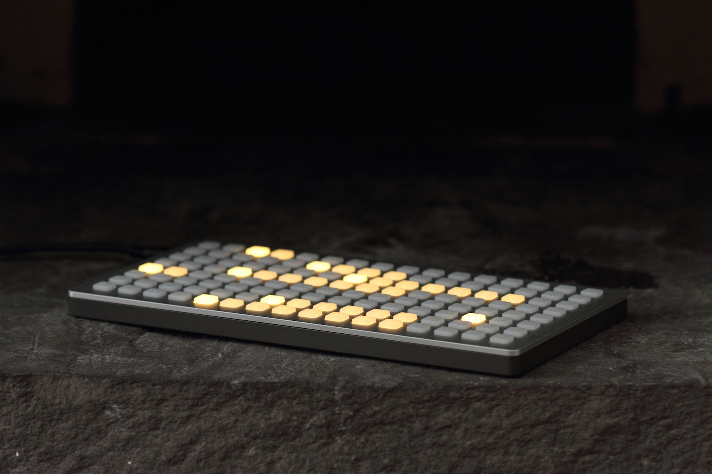

## history

this is grid.

it is the first instrument made by monome.

it is 128 keys (though it's also been 64 and 256) which are decoupled from their light, allowing both tactile and visual play. it's enclosed in sturdy aluminum (though it's also been walnut, steel, and silicone).

before we made other instruments, it was referred to as "a monome". as we made other instruments, it was still referred to as "a monome". ¯\\\_(ツ)\_/¯

## what does it do?

grid connects through USB to personal computers(LINK), Eurorack modules(LINK), and sound computers like norns(LINK). it is a highly flexible interface for applications within each of these environments.

grid communicates with applications to do a wide range of things: control MIDI devices, sequence modular synthesizers, cut samples, become an isometric keyboard, change faders, visualize streams of data, etc etc.

this core flexibility makes it hard to point to one use case and say "it does this." also, grid doesn't do things on its own. it's inherently modeless, adapting to the immediate needs of the artist. through one application, it can do traditional MIDI controller things. through another, it can facilitate + visualize realtime buffer manipulation.

## how do I use it?

most artists approach grid through two doors, often simultaneously: as an instrumentalist (using applications made by others) or as a designer (creating applications for others).

over the last 15 years, grid has connected instrumentalists + designers to create an ecosystem of applications(LINK). this exchange of ideas and energy has, in turn, created a community(LINK).

however you choose to approach it, grid is lasting -- both in construction and in response to your needs. it has no obsolescence because it has no preconceptions. as your needs / context / musical goals change, grid remains useful.

## further resources

- [editions](editions) - information about different device generations
- [disassembly](disassembly) - guides for disassembling the hardware
- [care](care) - some suggestions for device maintanance
- [bus power upgrade](buspowerupgrade) - some early grid models had external power, they can be updated

## grids in education

We offer an educational discount to currently enrolled college and university students. The discount is 10%, limited to a single grid which we sell directly. Contact `help@monome.org` with school and government IDs attached.

In addition, we also offer institutional package pricing and workshops extending from the Grid Studies series of tutorials. Please contact `help@monome.org` for further details and to discuss how we can best introduce the grids to your students.