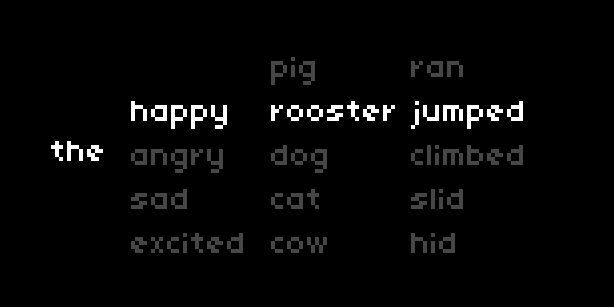

## ScrollingList

### control

| Syntax                                         | Description                                                                                                                                                                                                |
| ---------------------------------------------- | ---------------------------------------------------------------------------------------------------------------------------------------------------------------------------------------------------------- |
| UI.ScrollingList.new (x, y, index, entries)    | Create a new instance of list.<br>`x` and `y` are the screen coordinates where the list will begin: numbers <br> `index` is the default selected item: number <br> `entries` is the list of entries: table |
| my_scrollinglist:set_index (index)             | Set index : number                                                                                                                                                                                         |
| my_scrollinglist:set_index_delta (delta, wrap) | Set index using delta, with wrapping : number, boolean                                                                                                                                                     |
| my_scrollinglist:redraw ()                     | Redraw page with `ScrollingList` elements                                                                                                                                                                  |

### query

| Syntax                   | Description                                    |
| ------------------------ | ---------------------------------------------- |
| my_scrollinglist.x       | Returns originating x-coordinate : number      |
| my_scrollinglist.y       | Returns originating y-coordinate : number      |
| my_scrollinglist.index   | Returns current index : number                 |
| my_scrollinglist.entries | Returns list of entries : list                 |
| my_scrollinglist.active  | Returns scrolling list's active state: boolean |

### example



```lua
UI = require("ui")

-- create tables of entries
adjective = {'happy', 'angry', 'sad', 'excited', 'amused','bored','hungry','lazy'}
animal = {'pig', 'rooster', 'dog','cat','cow','rat','mouse','ox'}
verb = {'swam', 'ran','jumped','climbed','slid','hid','danced','stood','sat'}

-- creates instances of scrolling lists
scroll ={}

scroll[1] = UI.ScrollingList.new(20,8,1,adjective) 
scroll[2] = UI.ScrollingList.new(55,8,2,animal)
scroll[3] = UI.ScrollingList.new(90,8,3,verb)

message = {}

function redraw()
  screen.clear()
  screen.font_size(8)
  if message.display then
    message:redraw()
  else
    for i = 1,3 do -- redraw each scrolling list
      scroll[i]:redraw()
    end
    screen.move(0,34)
    screen.level(15)
    screen.text('the')
  end
  screen.update()
end

function key(n,z)
  if n == 2 and z == 1 then
    sentence = {'the '..adjective[scroll[1].index], animal[scroll[2].index]..' '..verb[scroll[3].index]} -- updates sentence using indexes
    message = UI.Message.new(sentence) -- creates a message using the sentence
    message.display = true -- displays message
  elseif n == 2 and z == 0 then
    message.display = false
  end
  redraw()
end

function enc(n,d)
  if not message.display then
    if n == 1 then
      scroll[1]:set_index_delta(d,false) -- sets index according to delta of E1, no wrapping
    elseif n == 2 then
      scroll[2]:set_index_delta(d,true) -- sets index according to delta of E2, with wrapping
    elseif n == 3 then
      scroll[3]:set_index_delta(d,false) -- sets index according to delta of E2, with no wrapping
    end
    redraw()
  end
end
```

### description

Creates a scrolling list in the on-screen UI. A maximum of five entries is shown at any one time, with at least one entry (or blank) shown above the selected entry. 

The UI is drawn using the `redraw()` function, which needs to be called when there is a change.

`UI.ScrollingList.new` returns a table which should be stored in a variable (eg. `scroll` in the example). The various other controls and queries can then be called using  the assigned variable in the manner described above.

In the example above, each instance of `ScrollingList` is stored in the three variables, `scroll[1]`, `scroll[2]`, and `scroll[3]`. 
