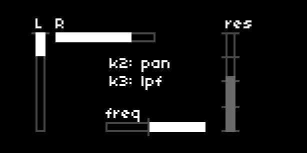

## Slider

### functions

| Syntax                                                                               | Description                                                                                                                                                                                                                                                                                                                                                                                                                                                                                                                                       |
| ------------------------------------------------------------------------------------ | ------------------------------------------------------------------------------------------------------------------------------------------------------------------------------------------------------------------------------------------------------------------------------------------------------------------------------------------------------------------------------------------------------------------------------------------------------------------------------------------------------------------------------------------------- |
| UI.Slider.new (x, y, width, height, value, min_value, max_value, markers, direction) | Create a new slider<br>`x` and `y` are the coordinates where the slider will be drawn: numbers <br>`width` and `height` are the width and height of the slider: numbers <br>`value` is the desired starting value: number <br> `min_value` and `max_value` are the minimum and maximum values respectively, by which `value` is clamped: numbers <br> `markers` are reference markers along the slider: table of floats or integers <br>`direction` is the direction in which the slider moves, defaults to `up`: `up`, `down`, `left` or `right` |
| my_slider:set_value (number)                                                         | Set value : number                                                                                                                                                                                                                                                                                                                                                                                                                                                                                                                                |
| my_slider:set_value_delta (delta)                                                    | Set value using delta : number                                                                                                                                                                                                                                                                                                                                                                                                                                                                                                                    |
| my_slider:set_marker_position (id, position)                                         | Set marker positions : number                                                                                                                                                                                                                                                                                                                                                                                                                                                                                                                     |
| my_slider:redraw ()                                                                  | Redraw slider                                                                                                                                                                                                                                                                                                                                                                                                                                                                                                                                     |

### variables

| Syntax              | Description                       |
| ------------------- | --------------------------------- |
| my_slider.x         | Originating x-coordinate : number |
| my_slider.y         | Originating y-coordinate : number |
| my_slider.width     | Width : number                    |
| my_slider.height    | Height : number                   |
| my_slider.value     | Slider's current value : number   |
| my_slider.min_value | Slider's minimum value : number   |
| my_slider.max_value | Slider's maximum value : number   |
| my_slider.markers   | Marker positions : table          |
| my_slider.direction | Slider's direction : string       |
| my_slider.active    | Slider's active state : boolean   |

### example



```lua
UI = require("ui")

slider = {}

-- create 4 sliders:
slider[1] = UI.Slider.new(5,10,5,50,30,0,127,{0},"down")
slider[2] = UI.Slider.new(15,10,50,5,97,0,127,{},"right")
slider[3] = UI.Slider.new(40,55,50,5,72,0,127,{72},"left")
slider[4] = UI.Slider.new(100,10,5,50,72,0,127,{0,32,64,96,127})
-- set fourth slider to inactive:
slider[4].active = false

-- label sliders
slider[1].label = "L"
slider[2].label = "R"
slider[3].label = "freq"
slider[4].label = "res"

function redraw()
  screen.clear()
  -- sliders need to be redrawn to display:
  for i = 1,4 do
    slider[i]:redraw()
  end
  screen.level(15)
  screen.move(slider[1].x,slider[1].y - 2) -- relative positioning using the originating x and y coordinates
  screen.text(slider[1].label)
  for i=2,4 do -- another way to position labels
    screen.move(slider[i].x,slider[i].y-2)
    screen.text(slider[i].label)
  end
  screen.move(42,28)
  screen.text("k2: pan")
  screen.move(42,37)
  screen.text("k3: lpf")
  screen.update()
end

function key(n,z)
  -- manipulating slider states + values:
  if n == 3 and z == 1 then
    slider[3].active = not slider[3].active
    slider[4].active = not slider[3].active
  elseif n == 2 then
    slider[1]:set_value(z == 1 and 97 or 30)
    slider[2]:set_value(z == 1 and 30 or 97)
  end
  redraw()
end

function enc(n,d)
  -- adjusting slider + marker values:
  if n == 3 then
    if slider[3].active then
      slider[3]:set_value_delta(d)
      slider[3]:set_marker_position(1,slider[3].value)
    else
      slider[4]:set_value_delta(d)
    end
    redraw()
  end
end
```

### description

Draws a slider on the screen from the specified (x, y) pair. Width and height can extend beyond the screen's bounds. Value is clamped to the slider's min and max values and can be changed by direct assignment or incremental adjustment. Reference markers can be added, in the form of a table of floats or integers. Direction defaults to "up" if it is not specified.
