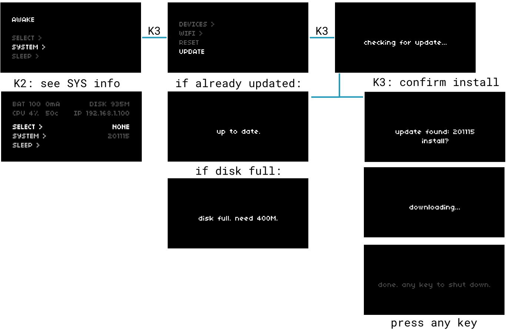
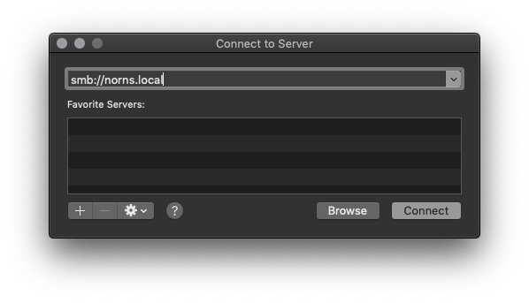
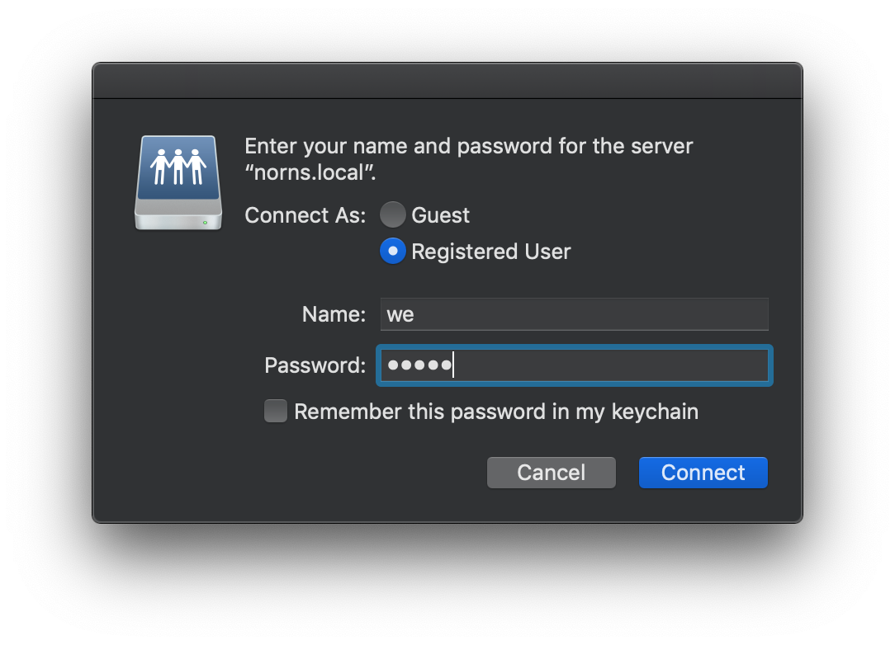
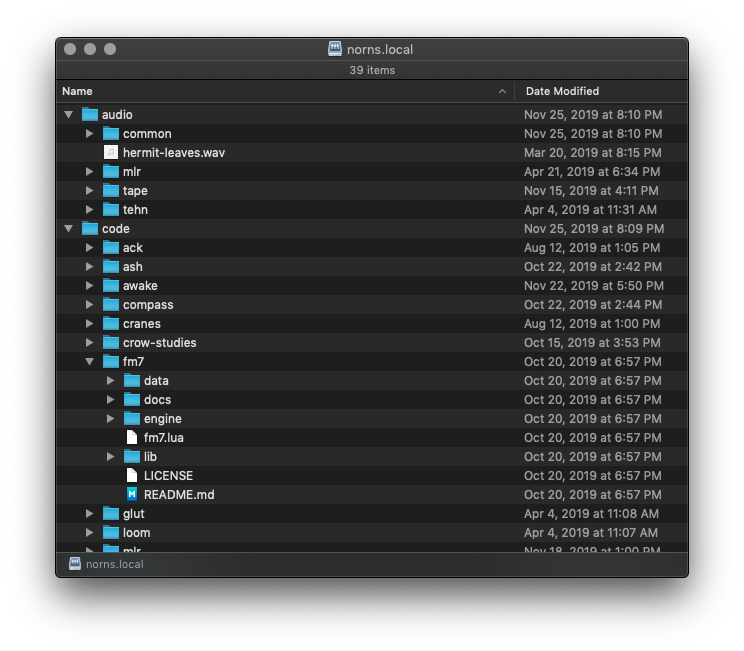
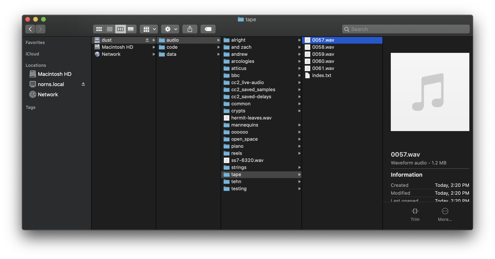

<!--# wifi + files-->

sections: [connect](#connect) &mdash; [update](#update) &mdash; [transfer](#transfer) &mdash; [advanced access](#advanced-access)

## connect

norns and shield are both capable of connecting to existing WIFI networks, or hosting their own as a hotspot.

shield has its own WIFI antenna built in, thanks to the Raspberry Pi. Stock norns has a "compute module" version of Pi, which doesn't have WIFI built in, so you will need to use a USB WIFI antenna. Stock norns comes with one, though any Linux-friendly dongle will work.

The first few minutes of this video walks through how to host a hotspot from norns and how to connect norns to a known WIFI network:

[](http://www.youtube.com/watch?v=Vf-Br3wwQRw "norns: wifi + maiden")  
*[figure 1: wifi + maiden access video](http://www.youtube.com/watch?v=Vf-Br3wwQRw)*

To connect norns to your local network router:

- navigate to **SYSTEM > WIFI**
- select **ADD**
- choose your network from the list displayed
- enter the password (**E2** toggles between top and bottom row, **E3** scrolls character, **K3** selects character)
- select **OK** when complete
- with success, you should be assigned an IP address shortly after

After a network is added, norns remembers the credentials. Known networks are stored under **CONNECT**. You can remove known networks under **DEL**.

If you do not have access to a router, you can also turn the norns into a WIFI hotspot. This will create a new network which you can then connect to with your computer:

- network namne / SSID: `norns`
- default password: `nnnnnnnn`

## update

Once norns is connected to a network, you can access system updates which fix bugs, add new features, and improve the overall experience.


*[figure 2: update process](image/wifi_maiden-images/update.png)*

To check for and install updates:

- connect to a WIFI network (updates cannot be performed via norns-powered hotspot)
- navigate to **SYSTEM > UPDATE** and press **K3**
- norns will check for available updates
- if norns finds an update, press **K3** to confirm installation
- after installation, press any key to safely shut norns down

To re-run an update, navigate to **SYSTEM > UPDATE**, then hold **K1** and press **K3**.

## transfer

In **play**, we loaded loops and recorded our own audio using the **TAPE**. All of the files that you interact with (audio, scripts, presets, etc), live inside of a special folder in norns called `dust`.

Here's the `dust` file tree:

```
dust/
  audio/          -- audio files
    tape/             -- tape recordings
    ...
  code/           -- contains scripts and engines
    awake/
    mlr/
    ...
    we/
  data/           -- contains user data created by scripts
    awake/            -- for example, pset data
```

`dust` management is best achieved via samba, a protocol that allows you to directly connect your computer's file browser to norns. If you haven't already, please connect your norns and your computer to the same WIFI network.

### macOS

Open Finder and hit CMD/Apple-K or navigate to `Go > Connect to Server`.

In the top IP address bar, enter: `smb://norns.local` and click Connect:



You may see an "Unsecured Connection" warning, but you can safely ignore it and click Connect.

Login as a Registered User with the following credentials:

- Name: `we`
- Password: `sleep`

...and click Connect one last time!



Once connected, you can freely navigate through files on norns:



### Windows

To use SMB network sharing on Windows 10, navigate to Control Panel > Programs > Programs and Features > Turn Windows features on or off, and turn on the SMB features. 

Then, reboot.

The norns.local file tree should be available at `\\norns.local`

### transferring audio

You can use samba to share audio files between norns and your computer. On norns, these files are stored under `dust/audio` -- depending on which scripts you have installed, you may see many folders under `audio` or just a few.

`tape` is where the TAPE function stores recordings made on your norns. You'll also find an `index.txt` file which logs the TAPE index -- if you wish to reset the auto-generated counter, edit this file to start back at 0.



Feel free to make folders inside `audio` to store various samples, field recordings, single cycle waveforms, etc. Each of those folders can also store subfolders, but please note that you cannot nest more than ten folder layers.

If you are importing audio to norns, please note that 48khz `.wav` files are best.

### backup

If you want to make a backup of your scripts, psets or other data simply make a copy of the `dust` directory found in `/home/we` via samba.

Restoring from this backup is as simple as copying this directory from your computer back to the `/home/we/dust` directory on norns.

## advanced access

### SSH

When connected via WIFI you can SSH into norns from another computer on the same network at the IP address shown in SYSTEM.

- open a Terminal on a Mac/Win/Linux computer
- execute `ssh we@norns.local` or `ssh we@<IP_ADDRESS_SHOWN_IN_SYSTEM>`
- password: `sleep`

### serial

Without WIFI, you can connect to norns via USB-UART by connecting the power cable to your computer. On Mac/linux, open a terminal and type:

**macOS**:

- `screen /dev/tty.usb`
- then, press TAB to autocomplete your serial number
- then type `115200`

You'll end up with something similar to: `screen /dev/tty.usbserial-A9053JEX 115200`

**linux**:

- `dmesg` to see what enumeration number your system gave norns
- you'll get something like this: `FTDI USB Serial Device converter now attached to ttyUSB0`
- then, type: `screen /dev/ttyUSB0` (or whatever enumeration number was given)
- then type `115200`

You'll end up with something similar to: `screen /dev/ttyUSB0 115200`

If you see a blank screen, press ENTER.

You'll be asked for login credentials. Login is the same as SSH above.

## where to next?

Now that you know how to get connected to WIFI, your norns is up to date, and you've got some fresh new audio to mangle, let's find some new community scripts through maiden!